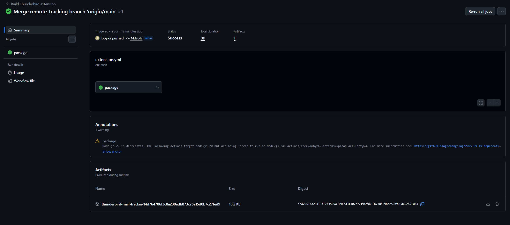
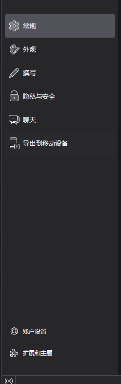
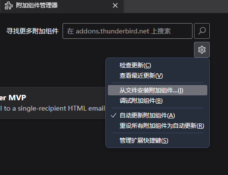
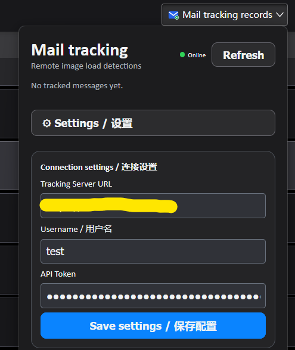
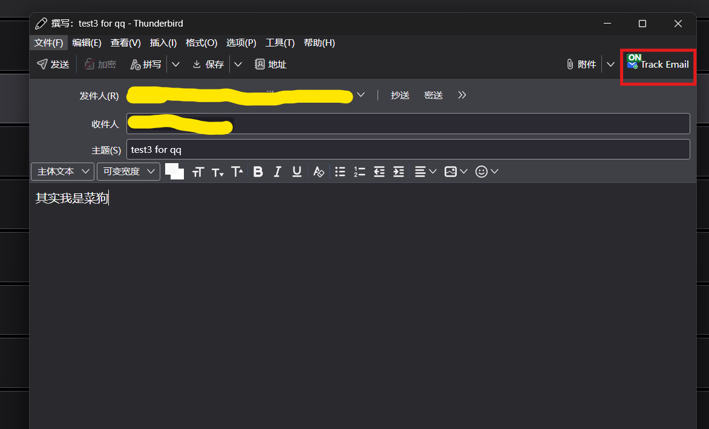
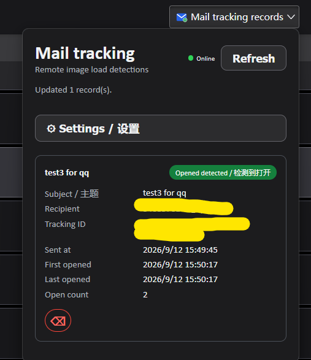

# Thunderbird Mail Tracker MVP

一个基于 Thunderbird MailExtension/WebExtension API、Manifest V3、原生 JavaScript 和 FastAPI 的邮件追踪 MVP。

用户在 HTML 写信窗口中主动启用追踪后，扩展会生成唯一 `tracking_id`，在正文末尾加入 1×1 透明 tracking pixel。收件端加载图片时，FastAPI 后端记录检测时间和次数，扩展页面查询并展示追踪状态。

“检测到打开 / Opened detected”只表示 tracking pixel URL 被请求，不等同于收件人真实阅读了邮件。Gmail 图片代理、Apple Mail Privacy Protection、企业邮箱安全扫描以及远程图片拦截，都可能造成误报或漏报。

AI还是太好用了，我是AI大人的狗。
<p align="center">
  
  
</p>

<h2 align="center" style="font-family:-apple-system,BlinkMacSystemFont,'Inter','Segoe UI','Microsoft YaHei',sans-serif;"><sup>“</sup>AI 还是太好用了，我是 AI 大人的狗。<sup>”</sup></h2>

## 使用效果及使用教程
### 远端服务部署参考下面部署章节
推荐uv，我喜欢uv，uv是正确的，有谁不喜欢快快的uv呢。当然docker里用的也是uv，docker的好处是隔离。
### client端也就是客户端
1.您需要先下载github action自动构建的.xpi插件（.zip解压之后），目前是会每次自动构建。

2.下载完后在 Thunderbird中按 侧边栏左下角设置->扩展和主题->右上角设置->从文件安装附加组件，选择解压出的.xpi文件即可。


3.完成远端服务器的url user token的设置

4.enjoy it
发送的时候注意点击开启邮件追踪，如下图红框。
注意一般接收端服务器会自动发出一次请求，所以一般请求数量大于等于2时，对方才可能阅读了。

成功喵

## 项目层级

```text
MailExtension/
├── extension/                         # Thunderbird 插件端
│   ├── manifest.json                  # Manifest V3、权限、入口和图标声明
│   ├── compose.js                     # 收件人解析与 HTML pixel 插入
│   ├── background.js                  # 发送前后事件、记录创建和本地存储
│   ├── popup.html / popup.css / popup.js # 状态列表、健康检查、配置和删除
│   ├── options.html / options.css / options.js # 独立配置页面
│   └── icons/tracker.svg              # 插件图标
├── server/                            # FastAPI 后端
│   ├── main.py                        # 路由、认证、CORS、像素和管理员接口
│   ├── database.py                    # SQLite 数据库操作
│   ├── models.py                      # Pydantic 数据模型
│   ├── admin.html                     # 管理员用户管理界面
│   ├── pyproject.toml / uv.lock       # uv 项目与锁定依赖
│   ├── requirements.txt               # 兼容用途的依赖清单
│   ├── Dockerfile                     # Docker 镜像构建
│   ├── entrypoint.sh                  # 数据卷权限修复与降权启动
│   ├── docker-compose.yml             # 服务、端口、环境变量和 SQLite volume
│   ├── .dockerignore                  # Docker 构建排除规则
│   └── .env.example                   # 管理员环境变量示例
└── README.md                          # 项目说明
```

## 组件关系

```text
写信窗口 → compose_action / onBeforeSend
         → 生成 tracking_id、POST /api/tracks、插入 pixel
         → onAfterSend 保存本地记录和 Message-ID

收件端 → GET /open/{tracking_id}.png → SQLite 更新打开状态
Popup  → Bearer Token → 查询 FastAPI 追踪状态
```

## 部署

### uv 本地部署

要求 Python 3.11+ 和 uv：

```bash
cd server
uv sync --locked
uv run --locked uvicorn main:app --host 0.0.0.0 --port 8000
```

SQLite 默认保存到 `server/data/tracker.db`。开发环境可使用 `--reload`。

### Docker Compose 部署

```bash
cd server
cp .env.example .env
# 编辑 .env，设置 ADMIN_USERNAME 和 ADMIN_PASSWORD
docker compose up -d --build
```

服务默认仅绑定虚拟机本机的 `127.0.0.1:8000`，数据保存于 Docker volume `tracker_data`。如需公网访问，应使用 Cloudflare Tunnel 或其他 HTTPS 反向代理转发到该本机端口；不要直接暴露 SQLite 或容器端口。

查看状态和日志：

```bash
docker compose ps
docker compose logs -f tracker-api
```

停止服务但保留数据库：

```bash
docker compose down
```

### 使用 GitHub Actions 已构建的镜像

GitHub Actions 发布的镜像地址为：

```text
ghcr.io/jboyxs/trackermail-tracker:latest
```

在服务器上创建 `docker-compose.image.yml`：

```yaml
services:
  tracker-api:
    image: ghcr.io/jboyxs/trackermail-tracker:latest
    ports:
      - "127.0.0.1:8000:8000"
    environment:
      DATABASE_PATH: /data/tracker.db
      ADMIN_USERNAME: ${ADMIN_USERNAME:-jjboy}
      ADMIN_PASSWORD: ${ADMIN_PASSWORD:?Set ADMIN_PASSWORD in .env}
    volumes:
      - tracker_data:/data
    restart: unless-stopped

volumes:
  tracker_data:
```

然后准备仅保存在服务器上的 `.env` 并启动：

```bash
printf 'ADMIN_USERNAME=your-admin-name\nADMIN_PASSWORD=replace-with-a-strong-password\n' > .env
chmod 600 .env
docker compose -f docker-compose.image.yml pull
docker compose -f docker-compose.image.yml up -d
```

如果 GHCR 镜像设置为私有，先使用具有 `read:packages` 权限的 GitHub Token 登录：

```bash
echo "$GITHUB_TOKEN" | docker login ghcr.io -u GITHUB_USERNAME --password-stdin
```

升级镜像时执行 `pull` 和 `up -d`；SQLite 数据会继续保存在 `tracker_data` volume 中。Cloudflare Tunnel 等反向代理仍应只转发到本机的 `127.0.0.1:8000`。

### Thunderbird 加载插件

在 Thunderbird 中打开：

`Settings → Add-ons and Themes → Debug Add-ons → Load Temporary Add-on`

然后选择 `extension/manifest.json`。修改代码后，在 Debug Add-ons 页面点击 Reload。

在插件 Popup 的 Settings 中填写 HTTPS Tracking Server URL、用户名和 API Token。非本机 `http://` 地址会显示风险警告；生产环境应使用 HTTPS。

### GitHub Actions 构建

`.github/workflows/extension.yml` 会在 `extension/` 发生变化或手动执行时，将插件打包为 `.xpi` 并作为 Actions Artifact 保存。打开 GitHub 仓库的 **Actions → Build Thunderbird extension → Run workflow**，完成后在运行结果的 **Artifacts** 下载。

`.github/workflows/server-image.yml` 会在 `server/` 发生变化并推送到 `main`，或推送形如 `v1.0.0` 的标签时，构建 Docker 镜像并发布到 GitHub Container Registry（GHCR）：

```text
ghcr.io/<github-owner>/<repository>-tracker:latest
```

工作流使用 GitHub 自动提供的 `GITHUB_TOKEN`，不需要额外配置 Docker Hub 密码。仓库的 **Settings → Actions → General** 需要允许工作流使用读写 `Packages` 权限。部署到服务器时，将 Compose 服务的 `build: .` 改为该镜像地址，并保留 `ADMIN_PASSWORD` 等运行时环境变量在服务器的 `.env` 中，不要写入 GitHub 或镜像。

## MVP 边界

当前版本只支持 HTML 邮件和单个收件人，暂不实现链接点击追踪、多收件人分别追踪、邮件列表自定义列、OAuth、推送通知、IP、User-Agent、设备指纹、地理位置和图表统计。
